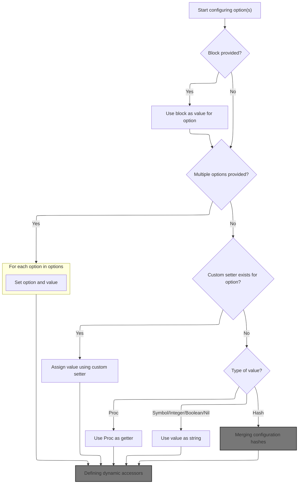
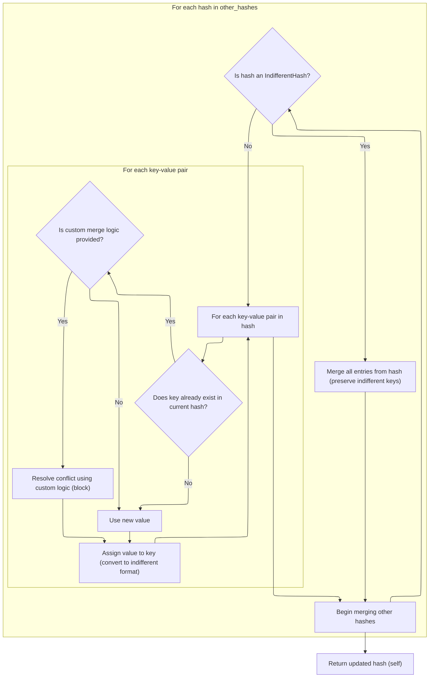
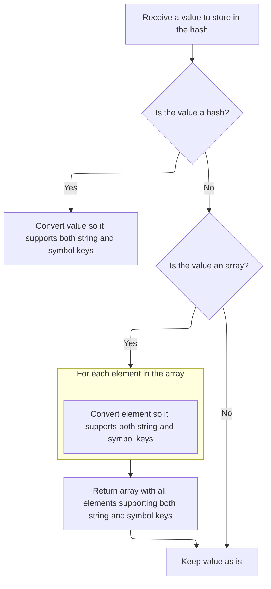
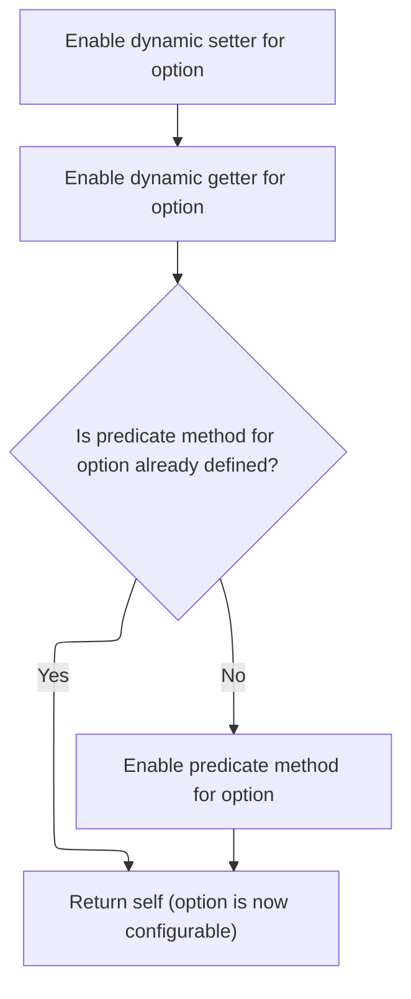
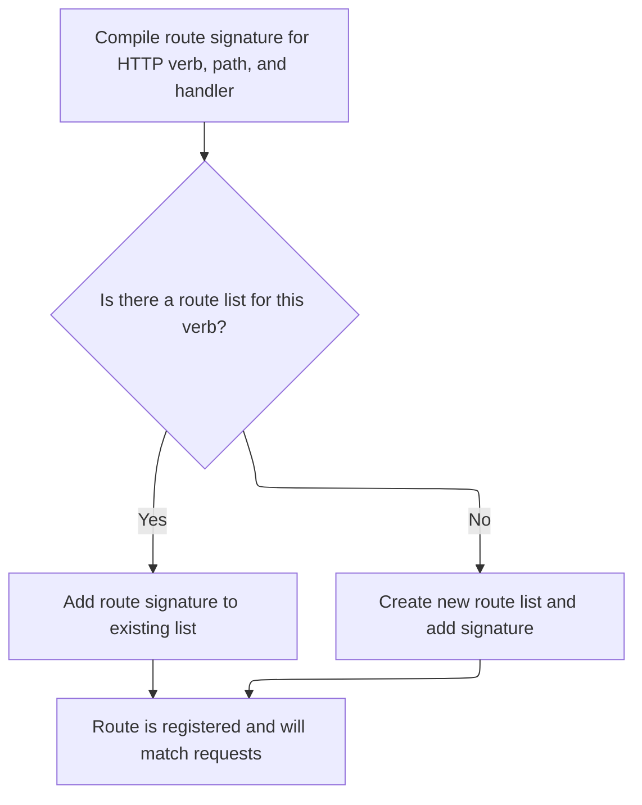
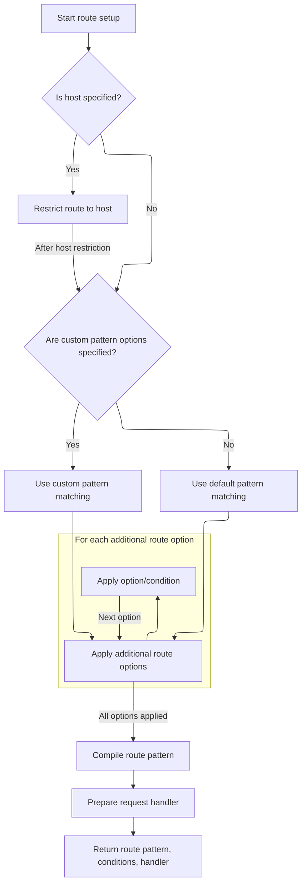

This document describes how a new route is registered and configured. By providing an HTTP verb, path, and options, the system sets up patterns and conditions to match incoming requests and associates them with the correct handler.

```mermaid
flowchart TD
  node1["Starting route setup"]:::HeadingStyle --> node2{"Is path empty and empty_path_info unset?
(Enabling options)"}:::HeadingStyle
  click node1 goToHeading "Starting route setup"
  click node2 goToHeading "Enabling options"
  node2 -->|"Yes"| node3["Enable empty_path_info option
(Enabling options)"]:::HeadingStyle
  click node3 goToHeading "Enabling options"
  node2 -->|"No"| node4["Building route patterns and conditions"]:::HeadingStyle
  click node4 goToHeading "Building route patterns and conditions"
  node3 --> node4
  node4 --> node5["Compiling and storing route signatures"]:::HeadingStyle
  click node5 goToHeading "Compiling and storing route signatures"
  node5 --> node6["Triggering route-added hooks"]:::HeadingStyle
  click node6 goToHeading "Triggering route-added hooks"
classDef HeadingStyle fill:#777777,stroke:#333,stroke-width:2px;

%% Swimm:
%% flowchart TD
%%   node1["Starting route setup"]:::HeadingStyle --> node2{"Is path empty and <SwmToken path="lib/sinatra/base.rb" pos="1779:4:4" line-data="        enable :empty_path_info if path == &#39;&#39; &amp;&amp; empty_path_info.nil?">`empty_path_info`</SwmToken> unset?
%% (Enabling options)"}:::HeadingStyle
%%   click node1 goToHeading "Starting route setup"
%%   click node2 goToHeading "Enabling options"
%%   node2 -->|"Yes"| node3["Enable <SwmToken path="lib/sinatra/base.rb" pos="1779:4:4" line-data="        enable :empty_path_info if path == &#39;&#39; &amp;&amp; empty_path_info.nil?">`empty_path_info`</SwmToken> option
%% (Enabling options)"]:::HeadingStyle
%%   click node3 goToHeading "Enabling options"
%%   node2 -->|"No"| node4["Building route patterns and conditions"]:::HeadingStyle
%%   click node4 goToHeading "Building route patterns and conditions"
%%   node3 --> node4
%%   node4 --> node5["Compiling and storing route signatures"]:::HeadingStyle
%%   click node5 goToHeading "Compiling and storing route signatures"
%%   node5 --> node6["Triggering route-added hooks"]:::HeadingStyle
%%   click node6 goToHeading "Triggering route-added hooks"
%% classDef HeadingStyle fill:#777777,stroke:#333,stroke-width:2px;
```



# Where is this flow used?

This flow is used multiple times in the codebase as represented in the following diagram:

(Note - these are only some of the entry points of this flow)

```mermaid
graph TD;
      0f774d4c21fbbdd42c8dd1d3260cf0751c0b4149e71e20200664e32bcf3ee86b(lib/sinatra/base.rb::get) --> 3b59b010d275ac029e4efc2cef6e1892596be4418085a8cd7f8c54f87aab80a7(lib/sinatra/base.rb::route):::mainFlowStyle

24153df8f876acf15d3aa811c5727502651d808738ea5909669b3e1f19caa3b3(lib/sinatra/base.rb::put) --> 3b59b010d275ac029e4efc2cef6e1892596be4418085a8cd7f8c54f87aab80a7(lib/sinatra/base.rb::route):::mainFlowStyle

3b220442d83ba15474d81ee18fb60477c833b7af8efe494d39b9a65b4db3c985(lib/sinatra/base.rb::post) --> 3b59b010d275ac029e4efc2cef6e1892596be4418085a8cd7f8c54f87aab80a7(lib/sinatra/base.rb::route):::mainFlowStyle

bb12dec520791487298da048f9f1aa627a0918d782eb6b0487f4c65cce593712(lib/sinatra/base.rb::delete) --> 3b59b010d275ac029e4efc2cef6e1892596be4418085a8cd7f8c54f87aab80a7(lib/sinatra/base.rb::route):::mainFlowStyle

54189bdc87acd5acb39fd1eddd80eaa40763b274fe24affa6bd54d3797e3ae12(lib/sinatra/base.rb::head) --> 3b59b010d275ac029e4efc2cef6e1892596be4418085a8cd7f8c54f87aab80a7(lib/sinatra/base.rb::route):::mainFlowStyle


classDef mainFlowStyle color:#000000,fill:#7CB9F4
classDef rootsStyle color:#000000,fill:#00FFF4
classDef Style1 color:#000000,fill:#00FFAA
classDef Style2 color:#000000,fill:#FFFF00
classDef Style3 color:#000000,fill:#AA7CB9

%% Swimm:
%% graph TD;
%%       0f774d4c21fbbdd42c8dd1d3260cf0751c0b4149e71e20200664e32bcf3ee86b(<SwmPath>[lib/sinatra/base.rb](lib/sinatra/base.rb)</SwmPath>::get) --> 3b59b010d275ac029e4efc2cef6e1892596be4418085a8cd7f8c54f87aab80a7(<SwmPath>[lib/sinatra/base.rb](lib/sinatra/base.rb)</SwmPath>::route):::mainFlowStyle
%% 
%% 24153df8f876acf15d3aa811c5727502651d808738ea5909669b3e1f19caa3b3(<SwmPath>[lib/sinatra/base.rb](lib/sinatra/base.rb)</SwmPath>::put) --> 3b59b010d275ac029e4efc2cef6e1892596be4418085a8cd7f8c54f87aab80a7(<SwmPath>[lib/sinatra/base.rb](lib/sinatra/base.rb)</SwmPath>::route):::mainFlowStyle
%% 
%% 3b220442d83ba15474d81ee18fb60477c833b7af8efe494d39b9a65b4db3c985(<SwmPath>[lib/sinatra/base.rb](lib/sinatra/base.rb)</SwmPath>::post) --> 3b59b010d275ac029e4efc2cef6e1892596be4418085a8cd7f8c54f87aab80a7(<SwmPath>[lib/sinatra/base.rb](lib/sinatra/base.rb)</SwmPath>::route):::mainFlowStyle
%% 
%% bb12dec520791487298da048f9f1aa627a0918d782eb6b0487f4c65cce593712(<SwmPath>[lib/sinatra/base.rb](lib/sinatra/base.rb)</SwmPath>::delete) --> 3b59b010d275ac029e4efc2cef6e1892596be4418085a8cd7f8c54f87aab80a7(<SwmPath>[lib/sinatra/base.rb](lib/sinatra/base.rb)</SwmPath>::route):::mainFlowStyle
%% 
%% 54189bdc87acd5acb39fd1eddd80eaa40763b274fe24affa6bd54d3797e3ae12(<SwmPath>[lib/sinatra/base.rb](lib/sinatra/base.rb)</SwmPath>::head) --> 3b59b010d275ac029e4efc2cef6e1892596be4418085a8cd7f8c54f87aab80a7(<SwmPath>[lib/sinatra/base.rb](lib/sinatra/base.rb)</SwmPath>::route):::mainFlowStyle
%% 
%% 
%% classDef mainFlowStyle color:#000000,fill:#7CB9F4
%% classDef rootsStyle color:#000000,fill:#00FFF4
%% classDef Style1 color:#000000,fill:#00FFAA
%% classDef Style2 color:#000000,fill:#FFFF00
%% classDef Style3 color:#000000,fill:#AA7CB9
```



# Starting route setup

```mermaid
%%{init: {"flowchart": {"defaultRenderer": "elk"}} }%%
flowchart TD
  node1["Register new route (verb, path, options)"] --> node2{"Is path empty and empty_path_info unset?"}
  click node1 openCode "lib/sinatra/base.rb:1778:1779"
  node2 -->|"Yes"| node3["Enabling options"]
  
  node2 -->|"No"| node4["Building route patterns and conditions"]
  
  node3 --> node4
  node4 --> node5["Store route signature for verb"]
  
  node5 --> node6["Trigger route added hook"]
  click node5 openCode "lib/sinatra/base.rb:1781:1782"
  node6 --> node7["Return compiled route signature"]
  click node6 openCode "lib/sinatra/base.rb:1782:1784"
  click node7 openCode "lib/sinatra/base.rb:1783:1784"

classDef HeadingStyle fill:#777777,stroke:#333,stroke-width:2px;
click node2 goToHeading "Enabling options"
node2:::HeadingStyle
click node3 goToHeading "Enabling options"
node3:::HeadingStyle
click node4 goToHeading "Building route patterns and conditions"
node4:::HeadingStyle

%% Swimm:
%% %%{init: {"flowchart": {"defaultRenderer": "elk"}} }%%
%% flowchart TD
%%   node1["Register new route (verb, path, options)"] --> node2{"Is path empty and <SwmToken path="lib/sinatra/base.rb" pos="1779:4:4" line-data="        enable :empty_path_info if path == &#39;&#39; &amp;&amp; empty_path_info.nil?">`empty_path_info`</SwmToken> unset?"}
%%   click node1 openCode "<SwmPath>[lib/sinatra/base.rb](lib/sinatra/base.rb)</SwmPath>:1778:1779"
%%   node2 -->|"Yes"| node3["Enabling options"]
%%   
%%   node2 -->|"No"| node4["Building route patterns and conditions"]
%%   
%%   node3 --> node4
%%   node4 --> node5["Store route signature for verb"]
%%   
%%   node5 --> node6["Trigger route added hook"]
%%   click node5 openCode "<SwmPath>[lib/sinatra/base.rb](lib/sinatra/base.rb)</SwmPath>:1781:1782"
%%   node6 --> node7["Return compiled route signature"]
%%   click node6 openCode "<SwmPath>[lib/sinatra/base.rb](lib/sinatra/base.rb)</SwmPath>:1782:1784"
%%   click node7 openCode "<SwmPath>[lib/sinatra/base.rb](lib/sinatra/base.rb)</SwmPath>:1783:1784"
%% 
%% classDef HeadingStyle fill:#777777,stroke:#333,stroke-width:2px;
%% click node2 goToHeading "Enabling options"
%% node2:::HeadingStyle
%% click node3 goToHeading "Enabling options"
%% node3:::HeadingStyle
%% click node4 goToHeading "Building route patterns and conditions"
%% node4:::HeadingStyle
```



<SwmSnippet path="/lib/sinatra/base.rb" line="1778">

---

In <SwmToken path="lib/sinatra/base.rb" pos="1778:3:3" line-data="      def route(verb, path, options = {}, &amp;block)">`route`</SwmToken>, we kick off the route definition. If the path is an empty string and :<SwmToken path="lib/sinatra/base.rb" pos="1779:4:4" line-data="        enable :empty_path_info if path == &#39;&#39; &amp;&amp; empty_path_info.nil?">`empty_path_info`</SwmToken> hasn't been set, we enable it. This is a subtle repo-specific tweak to make sure empty paths are routed as expected. Next, we call enable to actually set this option.

```ruby
      def route(verb, path, options = {}, &block)
        enable :empty_path_info if path == '' && empty_path_info.nil?
```

---

</SwmSnippet>

## Enabling options

<SwmSnippet path="/lib/sinatra/base.rb" line="1390">

---

<SwmToken path="lib/sinatra/base.rb" pos="1390:3:3" line-data="      def enable(*opts)">`enable`</SwmToken> just loops through the given options and sets each one to true using set. Next, set handles the details of updating the config.

```ruby
      def enable(*opts)
        opts.each { |key| set(key, true) }
      end
```

---

</SwmSnippet>

## Setting configuration values



<SwmSnippet path="/lib/sinatra/base.rb" line="1349">

---

In <SwmToken path="lib/sinatra/base.rb" pos="1349:3:3" line-data="      def set(option, value = (not_set = true), ignore_setter = false, &amp;block)">`set`</SwmToken>, we handle single or multiple options, define dynamic getter/setter methods, and deal with different value types. If the value is a hash, we merge it using IndifferentHash.merge next.

```ruby
      def set(option, value = (not_set = true), ignore_setter = false, &block)
        raise ArgumentError if block && !not_set

        if block
          value = block
          not_set = false
        end

        if not_set
          raise ArgumentError unless option.respond_to?(:each)

          option.each { |k, v| set(k, v) }
          return self
        end

        if respond_to?("#{option}=") && !ignore_setter
          return __send__("#{option}=", value)
        end

        setter = proc { |val| set option, val, true }
        getter = proc { value }

        case value
        when Proc
          getter = value
        when Symbol, Integer, FalseClass, TrueClass, NilClass
          getter = value.inspect
        when Hash
          setter = proc do |val|
            val = value.merge val if Hash === val
            set option, val, true
          end
        end

```

---

</SwmSnippet>

### Merging configuration hashes

<SwmSnippet path="/lib/sinatra/indifferent_hash.rb" line="143">

---

<SwmToken path="lib/sinatra/indifferent_hash.rb" pos="143:3:3" line-data="    def merge(*other_hashes, &amp;block)">`merge`</SwmToken> clones the hash and merges in the new values using merge!. Next, merge! does the actual merging logic.

```ruby
    def merge(*other_hashes, &block)
      dup.merge!(*other_hashes, &block)
    end
```

---

</SwmSnippet>

### Applying hash updates with key normalization



<SwmSnippet path="/lib/sinatra/indifferent_hash.rb" line="125">

---

In <SwmToken path="lib/sinatra/indifferent_hash.rb" pos="125:3:4" line-data="    def merge!(*other_hashes)">`merge!`</SwmToken>, we loop through each incoming hash, normalize keys, and use key? to check for existing keys. Next, key? uses <SwmToken path="lib/sinatra/indifferent_hash.rb" pos="131:5:5" line-data="            key = convert_key(key)">`convert_key`</SwmToken> for consistent lookups.

```ruby
    def merge!(*other_hashes)
      other_hashes.each do |other_hash|
        if other_hash.is_a?(self.class)
          super(other_hash)
        else
          other_hash.each_pair do |key, value|
            key = convert_key(key)
            value = yield(key, self[key], value) if block_given? && key?(key)
```

---

</SwmSnippet>

<SwmSnippet path="/lib/sinatra/indifferent_hash.rb" line="84">

---

<SwmToken path="lib/sinatra/indifferent_hash.rb" pos="84:3:4" line-data="    def key?(key)">`key?`</SwmToken> checks for a key after normalizing it with <SwmToken path="lib/sinatra/indifferent_hash.rb" pos="85:3:3" line-data="      super(convert_key(key))">`convert_key`</SwmToken>, so lookups are consistent no matter the key format.

```ruby
    def key?(key)
      super(convert_key(key))
    end
```

---

</SwmSnippet>

<SwmSnippet path="/lib/sinatra/indifferent_hash.rb" line="133">

---

We just returned from key normalization in merge!. Now, we assign the merged value after converting it with <SwmToken path="lib/sinatra/indifferent_hash.rb" pos="133:8:8" line-data="            self[key] = convert_value(value)">`convert_value`</SwmToken>, so everything stays in the right format.

```ruby
            self[key] = convert_value(value)
          end
        end
      end

      self
    end
```

---

</SwmSnippet>

### Normalizing hash and array values



<SwmSnippet path="/lib/sinatra/indifferent_hash.rb" line="197">

---

<SwmToken path="lib/sinatra/indifferent_hash.rb" pos="197:3:3" line-data="    def convert_value(value)">`convert_value`</SwmToken> wraps hashes and arrays in the right class, recursively. Next, map handles array element conversion.

```ruby
    def convert_value(value)
      case value
      when Hash
        value.is_a?(self.class) ? value : self.class[value]
      when Array
        value.map(&method(:convert_value))
      else
        value
      end
    end
```

---

</SwmSnippet>

### Transforming array elements

```mermaid
%%{init: {"flowchart": {"defaultRenderer": "elk"}} }%%
flowchart TD
    node1["Clone the current stream object"]
    click node1 openCode "sinatra-contrib/lib/sinatra/streaming.rb:119:119"
    node1 --> node2{"Existing transformation?"}
    click node2 openCode "sinatra-contrib/lib/sinatra/streaming.rb:125:125"
    node2 -->|"Yes"| node3["Compose new and existing transformations"]
    click node3 openCode "sinatra-contrib/lib/sinatra/streaming.rb:128:128"
    node2 -->|"No"| node4["Set transformation to new"]
    click node4 openCode "sinatra-contrib/lib/sinatra/streaming.rb:130:130"
    node3 --> node5["Return stream object with transformation applied"]
    click node5 openCode "sinatra-contrib/lib/sinatra/streaming.rb:131:131"
    node4 --> node5

classDef HeadingStyle fill:#777777,stroke:#333,stroke-width:2px;

%% Swimm:
%% %%{init: {"flowchart": {"defaultRenderer": "elk"}} }%%
%% flowchart TD
%%     node1["Clone the current stream object"]
%%     click node1 openCode "<SwmPath>[sinatra-contrib/…/sinatra/streaming.rb](sinatra-contrib/lib/sinatra/streaming.rb)</SwmPath>:119:119"
%%     node1 --> node2{"Existing transformation?"}
%%     click node2 openCode "<SwmPath>[sinatra-contrib/…/sinatra/streaming.rb](sinatra-contrib/lib/sinatra/streaming.rb)</SwmPath>:125:125"
%%     node2 -->|"Yes"| node3["Compose new and existing transformations"]
%%     click node3 openCode "<SwmPath>[sinatra-contrib/…/sinatra/streaming.rb](sinatra-contrib/lib/sinatra/streaming.rb)</SwmPath>:128:128"
%%     node2 -->|"No"| node4["Set transformation to new"]
%%     click node4 openCode "<SwmPath>[sinatra-contrib/…/sinatra/streaming.rb](sinatra-contrib/lib/sinatra/streaming.rb)</SwmPath>:130:130"
%%     node3 --> node5["Return stream object with transformation applied"]
%%     click node5 openCode "<SwmPath>[sinatra-contrib/…/sinatra/streaming.rb](sinatra-contrib/lib/sinatra/streaming.rb)</SwmPath>:131:131"
%%     node4 --> node5
%% 
%% classDef HeadingStyle fill:#777777,stroke:#333,stroke-width:2px;
```



<SwmSnippet path="/sinatra-contrib/lib/sinatra/streaming.rb" line="117">

---

<SwmToken path="sinatra-contrib/lib/sinatra/streaming.rb" pos="117:3:3" line-data="      def map(&amp;block)">`map`</SwmToken> clones the object (to keep mixins) and applies map! to transform elements. Next, map! composes transformations.

```ruby
      def map(&block)
        # dup would not copy the mixin
        clone.map!(&block)
      end
```

---

</SwmSnippet>

<SwmSnippet path="/sinatra-contrib/lib/sinatra/streaming.rb" line="122">

---

<SwmToken path="sinatra-contrib/lib/sinatra/streaming.rb" pos="122:3:4" line-data="      def map!(&amp;block)">`map!`</SwmToken> composes transformations if called multiple times, storing the chain in @transformer for later use.

```ruby
      def map!(&block)
        @transformer ||= nil

        if @transformer
          inner = @transformer
          outer = block
          block = proc { |value| outer[inner[value]] }
        end
        @transformer = block
        self
      end
```

---

</SwmSnippet>

### Defining dynamic accessors



<SwmSnippet path="/lib/sinatra/base.rb" line="1383">

---

We just returned from merging config values. Now, set defines getter, setter, and predicate methods dynamically using <SwmToken path="lib/sinatra/base.rb" pos="1383:1:1" line-data="        define_singleton(&quot;#{option}=&quot;, setter)">`define_singleton`</SwmToken> for easy access.

```ruby
        define_singleton("#{option}=", setter)
        define_singleton(option, getter)
        define_singleton("#{option}?", "!!#{option}") unless method_defined? "#{option}?"
        self
      end
```

---

</SwmSnippet>

<SwmSnippet path="/lib/sinatra/base.rb" line="1732">

---

<SwmToken path="lib/sinatra/base.rb" pos="1732:3:3" line-data="      def define_singleton(name, content = Proc.new)">`define_singleton`</SwmToken> removes any existing method before defining a new one, using either a String or Proc for the body, so you get a clean, object-specific method.

```ruby
      def define_singleton(name, content = Proc.new)
        singleton_class.class_eval do
          undef_method(name) if method_defined? name
          String === content ? class_eval("def #{name}() #{content}; end") : define_method(name, &content)
        end
      end
```

---

</SwmSnippet>

## Compiling and storing route signatures



<SwmSnippet path="/lib/sinatra/base.rb" line="1780">

---

We just returned from enabling options. Now, route compiles the route signature and stores it by verb in @routes for request matching.

```ruby
        signature = compile!(verb, path, block, **options)
        (@routes[verb] ||= []) << signature
```

---

</SwmSnippet>

## Building route patterns and conditions



<SwmSnippet path="/lib/sinatra/base.rb" line="1797">

---

In <SwmToken path="lib/sinatra/base.rb" pos="1797:3:4" line-data="      def compile!(verb, path, block, **options)">`compile!`</SwmToken>, we check for a :host option and pass it to <SwmToken path="lib/sinatra/base.rb" pos="1799:1:1" line-data="        host_name(options.delete(:host)) if options.key?(:host)">`host_name`</SwmToken> to set up host-based route conditions.

```ruby
      def compile!(verb, path, block, **options)
        # Because of self.options.host
        host_name(options.delete(:host)) if options.key?(:host)
```

---

</SwmSnippet>

<SwmSnippet path="/lib/sinatra/base.rb" line="1740">

---

<SwmToken path="lib/sinatra/base.rb" pos="1740:3:3" line-data="      def host_name(pattern)">`host_name`</SwmToken> adds a condition block that matches the request host against the given pattern using ===.

```ruby
      def host_name(pattern)
        condition { pattern === request.host }
      end
```

---

</SwmSnippet>

<SwmSnippet path="/lib/sinatra/base.rb" line="1800">

---

We just returned from <SwmToken path="lib/sinatra/base.rb" pos="1740:3:3" line-data="      def host_name(pattern)">`host_name`</SwmToken>. Now, compile! extracts Mustermann options for pattern matching and prepares them for the next step.

```ruby
        # Pass Mustermann opts to compile()
        route_mustermann_opts = options.key?(:mustermann_opts) ? options.delete(:mustermann_opts) : {}.freeze

```

---

</SwmSnippet>

<SwmSnippet path="/lib/sinatra/base.rb" line="1803">

---

We just returned from extracting Mustermann options. Now, compile! calls methods for each remaining option and passes everything to compile for pattern generation.

```ruby
        options.each_pair { |option, args| send(option, *args) }

        pattern                 = compile(path, route_mustermann_opts)
```

---

</SwmSnippet>

<SwmSnippet path="/lib/sinatra/base.rb" line="1817">

---

<SwmToken path="lib/sinatra/base.rb" pos="1817:3:3" line-data="      def compile(path, route_mustermann_opts = {})">`compile`</SwmToken> creates a Mustermann pattern from the path and options, so route matching is flexible.

```ruby
      def compile(path, route_mustermann_opts = {})
        Mustermann.new(path, **mustermann_opts.merge(route_mustermann_opts))
      end
```

---

</SwmSnippet>

<SwmSnippet path="/lib/sinatra/base.rb" line="1806">

---

We just returned from compile. Now, compile! generates an unbound method from the block, saves conditions, and creates a wrapper proc for later execution.

```ruby
        method_name             = "#{verb} #{path}"
        unbound_method          = generate_method(method_name, &block)
        conditions = @conditions
        @conditions = []
        wrapper = block.arity.zero? ?
          proc { |a, _p| unbound_method.bind(a).call } :
          proc { |a, p| unbound_method.bind(a).call(*p) }

        [pattern, conditions, wrapper]
      end
```

---

</SwmSnippet>

## Handling synchronous and asynchronous responses

<SwmSnippet path="/lib/sinatra/base.rb" line="226">

---

In <SwmToken path="lib/sinatra/base.rb" pos="226:3:3" line-data="    def call(env)">`call`</SwmToken>, we run the app and check for an async callback in env. Next, async? decides if the response should be handled asynchronously.

```ruby
    def call(env)
      result = app.call(env)
      callback = env['async.callback']
      return result unless callback && async?(*result)

```

---

</SwmSnippet>

<SwmSnippet path="/lib/sinatra/base.rb" line="251">

---

<SwmToken path="lib/sinatra/base.rb" pos="251:3:4" line-data="    def async?(status, _headers, body)">`async?`</SwmToken> returns true for status -1 or if the body supports callback/errback, marking the response as asynchronous.

```ruby
    def async?(status, _headers, body)
      return true if status == -1

      body.respond_to?(:callback) && body.respond_to?(:errback)
    end
```

---

</SwmSnippet>

<SwmSnippet path="/lib/sinatra/base.rb" line="231">

---

We just returned from async? in call. If the response is async, we schedule the callback, set up cleanup, and throw :async to switch to async handling.

```ruby
      after_response { callback.call result }
      setup_close(env, *result)
      throw :async
    end
```

---

</SwmSnippet>

## Triggering route-added hooks

<SwmSnippet path="/lib/sinatra/base.rb" line="1782">

---

We just returned from compiling the route. Now, route triggers the :<SwmToken path="lib/sinatra/base.rb" pos="1782:4:4" line-data="        invoke_hook(:route_added, verb, path, block)">`route_added`</SwmToken> hook so extensions can react to new routes.

```ruby
        invoke_hook(:route_added, verb, path, block)
        signature
      end
```

---

</SwmSnippet>

&nbsp;

*This is an auto-generated document by Swimm 🌊 and has not yet been verified by a human*

<SwmMeta version="3.0.0" repo-id="Z2l0aHViJTNBJTNBUnVieXNpbmF0cmElM0ElM0F1bWFsaW5nYXN3YW1p" repo-name="Rubysinatra"><sup>Powered by [Swimm](https://app.swimm.io/)</sup></SwmMeta>
