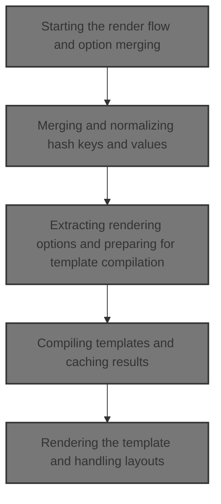
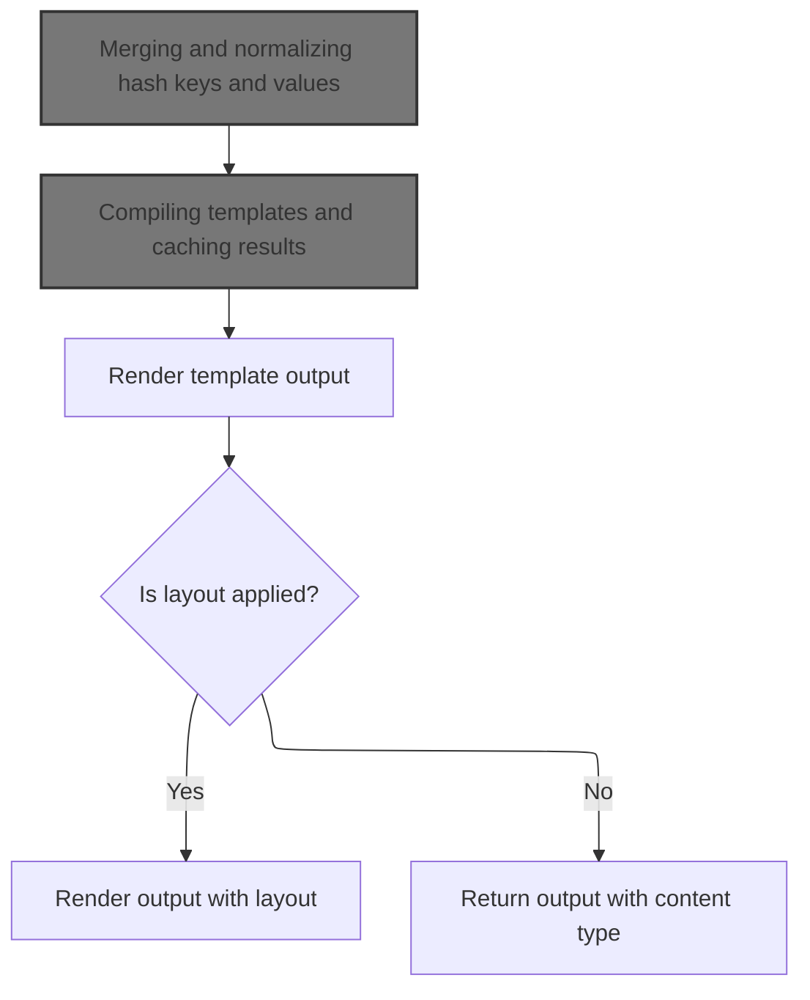
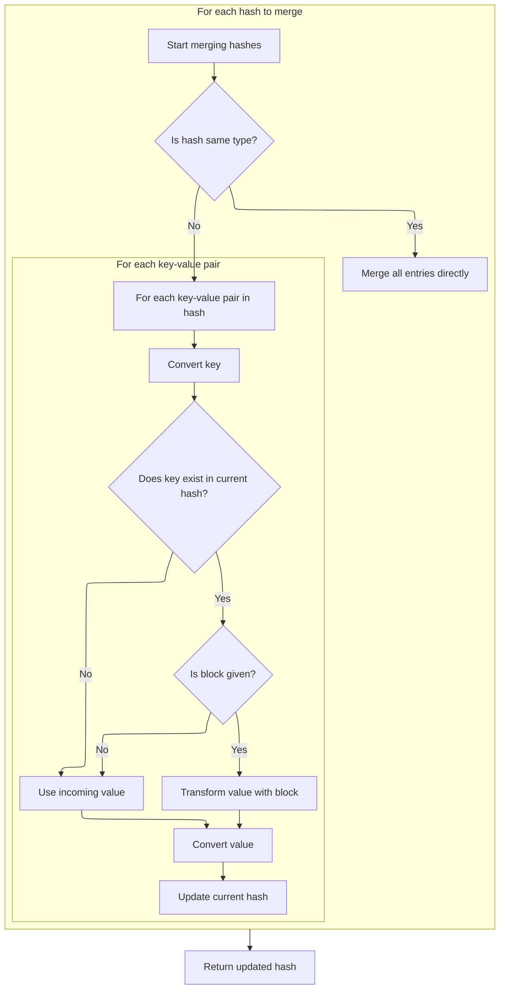
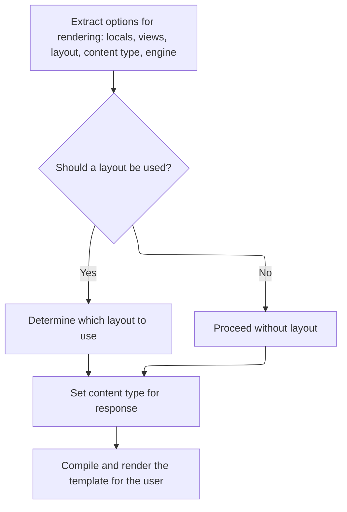
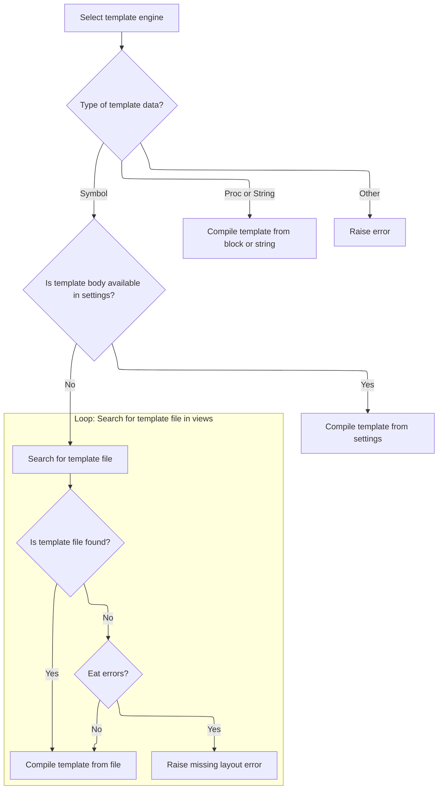
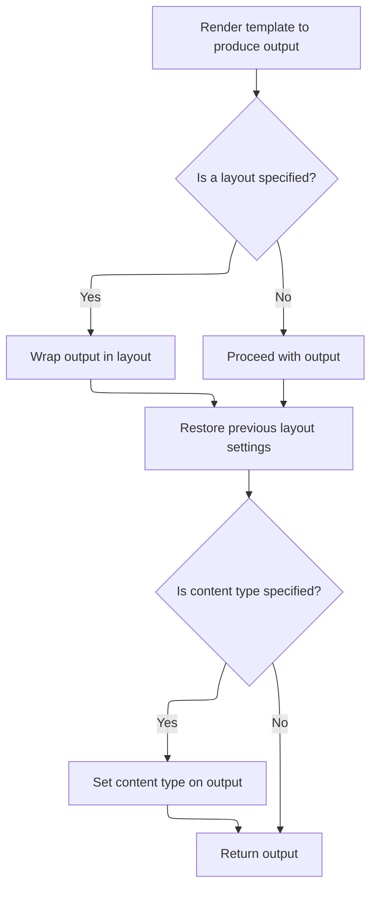

This document describes the flow for rendering templates, which produces dynamic content for users by merging rendering options from app settings and caller input. The flow supports multiple template engines and layouts, handling both static and dynamic templates. After compiling and rendering the template with local variables, the output may be wrapped in a layout and returned with the appropriate content type.



# Where is this flow used?

This flow is used multiple times in the codebase as represented in the following diagram:

(Note - these are only some of the entry points of this flow)

```mermaid
graph TD;
      c8a79c6b418c45fd28bf298f2e7e7285f745995beda5a6911b40b86e52542c72(lib/sinatra/base.rb::builder) --> 6c1600c56ea34d555b5676201bf101edcf61b7648a94fdfa7700f5c06361682e(lib/sinatra/base.rb::render_ruby)

6c1600c56ea34d555b5676201bf101edcf61b7648a94fdfa7700f5c06361682e(lib/sinatra/base.rb::render_ruby) --> 9408fa27ddab6a35a7f5e58089e62f8ef2e7ddaa026fd4d646490f02e2c25d3f(lib/sinatra/base.rb::render):::mainFlowStyle

a46e6175feea464d70e0530315fef8d1270b92722586936d8140a1b302776eb4(lib/sinatra/base.rb::markaby) --> 6c1600c56ea34d555b5676201bf101edcf61b7648a94fdfa7700f5c06361682e(lib/sinatra/base.rb::render_ruby)

9b4c960922b2840a9554aed3b95471ce7278ef74d79685cef11dcef275e12d74(lib/sinatra/base.rb::nokogiri) --> 6c1600c56ea34d555b5676201bf101edcf61b7648a94fdfa7700f5c06361682e(lib/sinatra/base.rb::render_ruby)

cb3bdc9cd85cc949b94ae6fb89241ff3153d4ab4e4091b633c8263d2dccbe600(lib/sinatra/base.rb::erb) --> 9408fa27ddab6a35a7f5e58089e62f8ef2e7ddaa026fd4d646490f02e2c25d3f(lib/sinatra/base.rb::render):::mainFlowStyle

d78e5a3ddf3818685f9e734b727fb8b4db46d12f698211586a6a262fbf1932c0(lib/sinatra/base.rb::haml) --> 9408fa27ddab6a35a7f5e58089e62f8ef2e7ddaa026fd4d646490f02e2c25d3f(lib/sinatra/base.rb::render):::mainFlowStyle


classDef mainFlowStyle color:#000000,fill:#7CB9F4
classDef rootsStyle color:#000000,fill:#00FFF4
classDef Style1 color:#000000,fill:#00FFAA
classDef Style2 color:#000000,fill:#FFFF00
classDef Style3 color:#000000,fill:#AA7CB9

%% Swimm:
%% graph TD;
%%       c8a79c6b418c45fd28bf298f2e7e7285f745995beda5a6911b40b86e52542c72(<SwmPath>[lib/sinatra/base.rb](lib/sinatra/base.rb)</SwmPath>::builder) --> 6c1600c56ea34d555b5676201bf101edcf61b7648a94fdfa7700f5c06361682e(<SwmPath>[lib/sinatra/base.rb](lib/sinatra/base.rb)</SwmPath>::<SwmToken path="lib/sinatra/base.rb" pos="779:1:1" line-data="      render_ruby(:builder, template, options, locals, &amp;block)">`render_ruby`</SwmToken>)
%% 
%% 6c1600c56ea34d555b5676201bf101edcf61b7648a94fdfa7700f5c06361682e(<SwmPath>[lib/sinatra/base.rb](lib/sinatra/base.rb)</SwmPath>::<SwmToken path="lib/sinatra/base.rb" pos="779:1:1" line-data="      render_ruby(:builder, template, options, locals, &amp;block)">`render_ruby`</SwmToken>) --> 9408fa27ddab6a35a7f5e58089e62f8ef2e7ddaa026fd4d646490f02e2c25d3f(<SwmPath>[lib/sinatra/base.rb](lib/sinatra/base.rb)</SwmPath>::render):::mainFlowStyle
%% 
%% a46e6175feea464d70e0530315fef8d1270b92722586936d8140a1b302776eb4(<SwmPath>[lib/sinatra/base.rb](lib/sinatra/base.rb)</SwmPath>::markaby) --> 6c1600c56ea34d555b5676201bf101edcf61b7648a94fdfa7700f5c06361682e(<SwmPath>[lib/sinatra/base.rb](lib/sinatra/base.rb)</SwmPath>::<SwmToken path="lib/sinatra/base.rb" pos="779:1:1" line-data="      render_ruby(:builder, template, options, locals, &amp;block)">`render_ruby`</SwmToken>)
%% 
%% 9b4c960922b2840a9554aed3b95471ce7278ef74d79685cef11dcef275e12d74(<SwmPath>[lib/sinatra/base.rb](lib/sinatra/base.rb)</SwmPath>::nokogiri) --> 6c1600c56ea34d555b5676201bf101edcf61b7648a94fdfa7700f5c06361682e(<SwmPath>[lib/sinatra/base.rb](lib/sinatra/base.rb)</SwmPath>::<SwmToken path="lib/sinatra/base.rb" pos="779:1:1" line-data="      render_ruby(:builder, template, options, locals, &amp;block)">`render_ruby`</SwmToken>)
%% 
%% cb3bdc9cd85cc949b94ae6fb89241ff3153d4ab4e4091b633c8263d2dccbe600(<SwmPath>[lib/sinatra/base.rb](lib/sinatra/base.rb)</SwmPath>::erb) --> 9408fa27ddab6a35a7f5e58089e62f8ef2e7ddaa026fd4d646490f02e2c25d3f(<SwmPath>[lib/sinatra/base.rb](lib/sinatra/base.rb)</SwmPath>::render):::mainFlowStyle
%% 
%% d78e5a3ddf3818685f9e734b727fb8b4db46d12f698211586a6a262fbf1932c0(<SwmPath>[lib/sinatra/base.rb](lib/sinatra/base.rb)</SwmPath>::haml) --> 9408fa27ddab6a35a7f5e58089e62f8ef2e7ddaa026fd4d646490f02e2c25d3f(<SwmPath>[lib/sinatra/base.rb](lib/sinatra/base.rb)</SwmPath>::render):::mainFlowStyle
%% 
%% 
%% classDef mainFlowStyle color:#000000,fill:#7CB9F4
%% classDef rootsStyle color:#000000,fill:#00FFF4
%% classDef Style1 color:#000000,fill:#00FFAA
%% classDef Style2 color:#000000,fill:#FFFF00
%% classDef Style3 color:#000000,fill:#AA7CB9
```



# Starting the render flow and option merging



<SwmSnippet path="/lib/sinatra/base.rb" line="844">

---

In <SwmToken path="lib/sinatra/base.rb" pos="844:3:3" line-data="    def render(engine, data, options = {}, locals = {}, &amp;block)">`render`</SwmToken>, we start by grabbing engine-specific options from the app settings and merge them with whatever options were passed in. This sets up the config for rendering. Next, we need to check AcceptEntry.respond_to? to see if the engine is supported, which determines if we can proceed with rendering using that engine.

```ruby
    def render(engine, data, options = {}, locals = {}, &block)
      # merge app-level options
      engine_options = settings.respond_to?(engine) ? settings.send(engine) : {}
```

---

</SwmSnippet>

<SwmSnippet path="/lib/sinatra/base.rb" line="128">

---

<SwmToken path="lib/sinatra/base.rb" pos="128:3:4" line-data="      def respond_to?(*args)">`respond_to?`</SwmToken> checks if the object supports a method, and if not, it checks if its string version does. This lets us handle cases where the engine name might not be a plain string but can act like one, so we don't miss valid engines.

```ruby
      def respond_to?(*args)
        super || to_str.respond_to?(*args)
      end
```

---

</SwmSnippet>

<SwmSnippet path="/lib/sinatra/base.rb" line="847">

---

Back in <SwmToken path="lib/sinatra/base.rb" pos="844:3:3" line-data="    def render(engine, data, options = {}, locals = {}, &amp;block)">`render`</SwmToken>, after confirming engine compatibility, we merge <SwmToken path="lib/sinatra/base.rb" pos="847:6:6" line-data="      options.merge!(engine_options) { |_key, v1, _v2| v1 }">`engine_options`</SwmToken> into options. This brings in defaults from the app settings, but lets the caller override them. Next, we need to use <SwmPath>[lib/sinatra/indifferent_hash.rb](lib/sinatra/indifferent_hash.rb)</SwmPath> to handle the merge, since it normalizes keys and values for consistency.

```ruby
      options.merge!(engine_options) { |_key, v1, _v2| v1 }

```

---

</SwmSnippet>

## Merging and normalizing hash keys and values



<SwmSnippet path="/lib/sinatra/indifferent_hash.rb" line="125">

---

In <SwmToken path="lib/sinatra/indifferent_hash.rb" pos="125:3:4" line-data="    def merge!(*other_hashes)">`merge!`</SwmToken>, we loop through each hash to merge, normalizing keys and values using <SwmToken path="lib/sinatra/indifferent_hash.rb" pos="131:5:5" line-data="            key = convert_key(key)">`convert_key`</SwmToken> and <SwmToken path="lib/sinatra/indifferent_hash.rb" pos="133:8:8" line-data="            self[key] = convert_value(value)">`convert_value`</SwmToken>. If the hash is the same class, we delegate to the parent merge. If not, we handle each key-value pair, resolving conflicts with a block if needed. This keeps option hashes consistent for downstream use.

```ruby
    def merge!(*other_hashes)
      other_hashes.each do |other_hash|
        if other_hash.is_a?(self.class)
          super(other_hash)
        else
          other_hash.each_pair do |key, value|
            key = convert_key(key)
            value = yield(key, self[key], value) if block_given? && key?(key)
```

---

</SwmSnippet>

<SwmSnippet path="/lib/sinatra/indifferent_hash.rb" line="84">

---

<SwmToken path="lib/sinatra/indifferent_hash.rb" pos="84:3:4" line-data="    def key?(key)">`key?`</SwmToken> checks for a key after normalizing it with <SwmToken path="lib/sinatra/indifferent_hash.rb" pos="85:3:3" line-data="      super(convert_key(key))">`convert_key`</SwmToken>. This means option lookups work even if the key format varies, so we don't miss entries due to format mismatches.

```ruby
    def key?(key)
      super(convert_key(key))
    end
```

---

</SwmSnippet>

<SwmSnippet path="/lib/sinatra/indifferent_hash.rb" line="133">

---

After normalizing keys, we also convert values before storing them in the hash. This keeps all entries consistent for later use. Returning self lets us chain merges if needed.

```ruby
            self[key] = convert_value(value)
          end
        end
      end

      self
    end
```

---

</SwmSnippet>

<SwmSnippet path="/lib/sinatra/indifferent_hash.rb" line="197">

---

<SwmToken path="lib/sinatra/indifferent_hash.rb" pos="197:3:3" line-data="    def convert_value(value)">`convert_value`</SwmToken> checks if a value is a hash or array, and if so, converts it (recursively for arrays) to the right class. This keeps nested option structures normalized for later use.

```ruby
    def convert_value(value)
      case value
      when Hash
        value.is_a?(self.class) ? value : self.class[value]
      when Array
        value.map(&method(:convert_value))
      else
        value
      end
    end
```

---

</SwmSnippet>

## Extracting rendering options and preparing for template compilation



<SwmSnippet path="/lib/sinatra/base.rb" line="849">

---

After merging options, <SwmToken path="lib/sinatra/base.rb" pos="869:7:7" line-data="      # compile and render template">`render`</SwmToken> pulls out all the rendering-related options and sets up defaults and fallbacks for things like layout and encoding. Next, we call <SwmToken path="lib/sinatra/base.rb" pos="873:5:5" line-data="        template        = compile_template(engine, data, options, views)">`compile_template`</SwmToken> to actually build the template with these settings.

```ruby
      # extract generic options
      locals          = options.delete(:locals) || locals         || {}
      views           = options.delete(:views)  || settings.views || './views'
      layout          = options[:layout]
      layout          = false if layout.nil? && options.include?(:layout)
      eat_errors      = layout.nil?
      layout          = engine_options[:layout] if layout.nil? || (layout == true && engine_options[:layout] != false)
      layout          = @default_layout         if layout.nil? || (layout == true)
      layout_options  = options.delete(:layout_options) || {}
      content_type    = options.delete(:default_content_type)
      content_type    = options.delete(:content_type)   || content_type
      layout_engine   = options.delete(:layout_engine)  || engine
      scope           = options.delete(:scope)          || self
      exclude_outvar  = options.delete(:exclude_outvar)
      options.delete(:layout)

      # set some defaults
      options[:outvar] ||= '@_out_buf' unless exclude_outvar
      options[:default_encoding] ||= settings.default_encoding

      # compile and render template
      begin
        layout_was      = @default_layout
        @default_layout = false
        template        = compile_template(engine, data, options, views)
```

---

</SwmSnippet>

## Compiling templates and caching results



<SwmSnippet path="/lib/sinatra/base.rb" line="895">

---

In <SwmToken path="lib/sinatra/base.rb" pos="895:3:3" line-data="    def compile_template(engine, data, options, views)">`compile_template`</SwmToken>, we check if the template is already cached for the given engine, data, options, and views. If not, we build it (handling symbols, callables, and missing layouts) and store it in the cache. This keeps rendering fast and avoids duplicate work.

```ruby
    def compile_template(engine, data, options, views)
      eat_errors = options.delete :eat_errors
      template = Tilt[engine]
      raise "Template engine not found: #{engine}" if template.nil?

      case data
      when Symbol
        template_cache.fetch engine, data, options, views do
          body, path, line = settings.templates[data]
          if body
            body = body.call if body.respond_to?(:call)
            template.new(path, line.to_i, options) { body }
          else
            found = false
            @preferred_extension = engine.to_s
            find_template(views, data, template) do |file|
              path ||= file # keep the initial path rather than the last one
              found = File.exist?(file)
              if found
                path = file
                break
              end
            end
            throw :layout_missing if eat_errors && !found
            template.new(path, 1, options)
          end
        end
```

---

</SwmSnippet>

<SwmSnippet path="/lib/sinatra/base.rb" line="960">

---

<SwmToken path="lib/sinatra/base.rb" pos="960:3:3" line-data="    def fetch(*key)">`fetch`</SwmToken> in <SwmToken path="lib/sinatra/base.rb" pos="951:3:3" line-data="  class TemplateCache">`TemplateCache`</SwmToken> uses an array of keys to cache templates, so each <SwmPath>[test/views/](test/views/)</SwmPath> combo gets its own entry. If the cache misses, it builds and stores the template using the block.

```ruby
    def fetch(*key)
      @cache.fetch(key) do
        @cache[key] = yield
      end
    end
```

---

</SwmSnippet>

<SwmSnippet path="/lib/sinatra/base.rb" line="905">

---

After fetching from <SwmToken path="lib/sinatra/base.rb" pos="951:3:3" line-data="  class TemplateCache">`TemplateCache`</SwmToken> in <SwmToken path="lib/sinatra/base.rb" pos="873:5:5" line-data="        template        = compile_template(engine, data, options, views)">`compile_template`</SwmToken>, we check if the template body is callable and call it if so. This lets us handle dynamic templates that generate their content on demand. Next, we check AcceptEntry.respond_to? to make sure the engine can handle the result.

```ruby
            body = body.call if body.respond_to?(:call)
```

---

</SwmSnippet>

<SwmSnippet path="/lib/sinatra/base.rb" line="906">

---

After checking engine compatibility, <SwmToken path="lib/sinatra/base.rb" pos="873:5:5" line-data="        template        = compile_template(engine, data, options, views)">`compile_template`</SwmToken> finishes by handling templates as symbols, procs, or strings, caching them as needed. If a symbol can't be resolved, it throws :<SwmToken path="lib/sinatra/base.rb" pos="918:4:4" line-data="            throw :layout_missing if eat_errors &amp;&amp; !found">`layout_missing`</SwmToken> if errors should be eaten. This lets us support static, dynamic, and inline templates, all cached for speed.

```ruby
            template.new(path, line.to_i, options) { body }
          else
            found = false
            @preferred_extension = engine.to_s
            find_template(views, data, template) do |file|
              path ||= file # keep the initial path rather than the last one
              found = File.exist?(file)
              if found
                path = file
                break
              end
            end
            throw :layout_missing if eat_errors && !found
            template.new(path, 1, options)
          end
        end
      when Proc
        compile_block_template(template, options, &data)
      when String
        template_cache.fetch engine, data, options, views do
          compile_block_template(template, options) { data }
        end
      else
        raise ArgumentError, "Sorry, don't know how to render #{data.inspect}."
      end
    end
```

---

</SwmSnippet>

## Rendering the template and handling layouts



<SwmSnippet path="/lib/sinatra/base.rb" line="874">

---

After compiling the template in <SwmToken path="lib/sinatra/base.rb" pos="874:7:7" line-data="        output          = template.render(scope, locals, &amp;block)">`render`</SwmToken>, we render it with the given scope and locals, making sure @<SwmToken path="lib/sinatra/base.rb" pos="876:2:2" line-data="        @default_layout = layout_was">`default_layout`</SwmToken> doesn't interfere. If a layout is specified, we prep extra options and merge them using <SwmPath>[lib/sinatra/indifferent_hash.rb](lib/sinatra/indifferent_hash.rb)</SwmPath> before recursively rendering the layout.

```ruby
        output          = template.render(scope, locals, &block)
      ensure
        @default_layout = layout_was
      end

      # render layout
      if layout
        extra_options = { views: views, layout: false, eat_errors: eat_errors, scope: scope }
        options = options.merge(extra_options).merge!(layout_options)
```

---

</SwmSnippet>

<SwmSnippet path="/lib/sinatra/indifferent_hash.rb" line="143">

---

<SwmToken path="lib/sinatra/indifferent_hash.rb" pos="143:3:3" line-data="    def merge(*other_hashes, &amp;block)">`merge`</SwmToken> duplicates the hash and merges in new options, so we get a fresh set for layout rendering without messing up the originals.

```ruby
    def merge(*other_hashes, &block)
      dup.merge!(*other_hashes, &block)
    end
```

---

</SwmSnippet>

<SwmSnippet path="/lib/sinatra/base.rb" line="882">

---

After merging extra options for layout, we merge in <SwmToken path="lib/sinatra/base.rb" pos="882:15:15" line-data="        options = options.merge(extra_options).merge!(layout_options)">`layout_options`</SwmToken> to make sure layout-specific settings win. Then we call render recursively for the layout, using catch(:<SwmToken path="lib/sinatra/base.rb" pos="884:4:4" line-data="        catch(:layout_missing) { return render(layout_engine, layout, options, locals) { output } }">`layout_missing`</SwmToken>) to handle missing layouts cleanly.

```ruby
        options = options.merge(extra_options).merge!(layout_options)

        catch(:layout_missing) { return render(layout_engine, layout, options, locals) { output } }
      end

```

---

</SwmSnippet>

<SwmSnippet path="/lib/sinatra/base.rb" line="887">

---

At the end of <SwmToken path="lib/sinatra/base.rb" pos="844:3:3" line-data="    def render(engine, data, options = {}, locals = {}, &amp;block)">`render`</SwmToken>, if <SwmToken path="lib/sinatra/base.rb" pos="887:3:3" line-data="      if content_type">`content_type`</SwmToken> is set, we duplicate the output string and extend it with <SwmToken path="lib/sinatra/base.rb" pos="890:5:5" line-data="        output.extend(ContentTyped).content_type = content_type">`ContentTyped`</SwmToken> to attach the <SwmToken path="lib/sinatra/base.rb" pos="887:3:3" line-data="      if content_type">`content_type`</SwmToken>. This makes sure the response has the right type and avoids frozen string errors.

```ruby
      if content_type
        # sass-embedded returns a frozen string
        output = +output
        output.extend(ContentTyped).content_type = content_type
      end
      output
    end
```

---

</SwmSnippet>

&nbsp;

*This is an auto-generated document by Swimm 🌊 and has not yet been verified by a human*

<SwmMeta version="3.0.0" repo-id="Z2l0aHViJTNBJTNBUnVieXNpbmF0cmElM0ElM0F1bWFsaW5nYXN3YW1p" repo-name="Rubysinatra"><sup>Powered by [Swimm](https://app.swimm.io/)</sup></SwmMeta>
