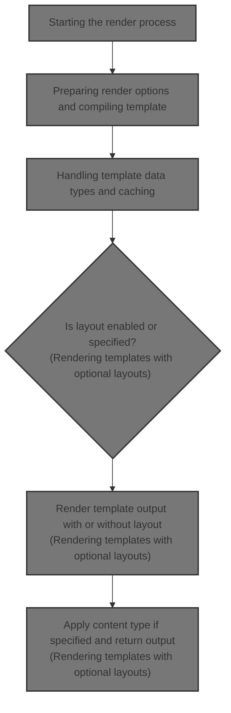
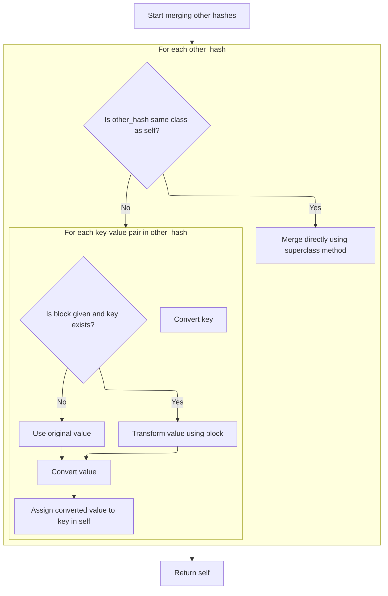
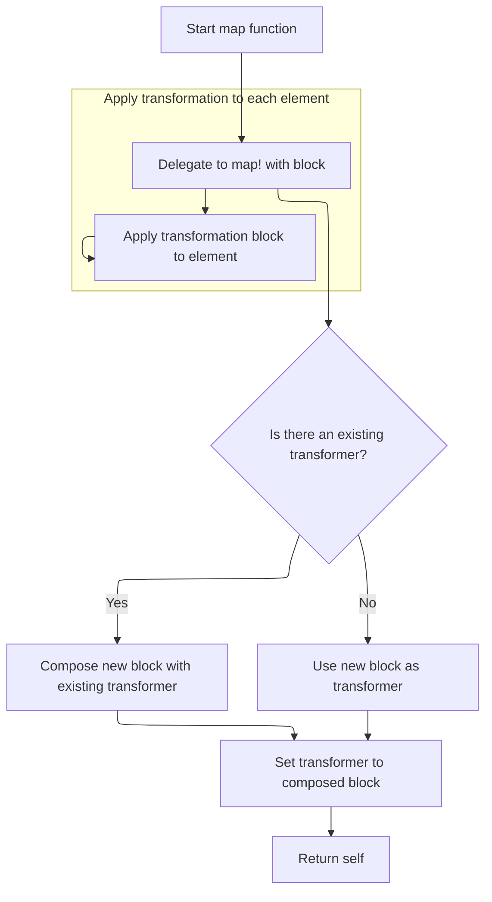
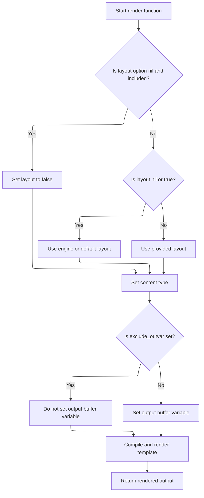
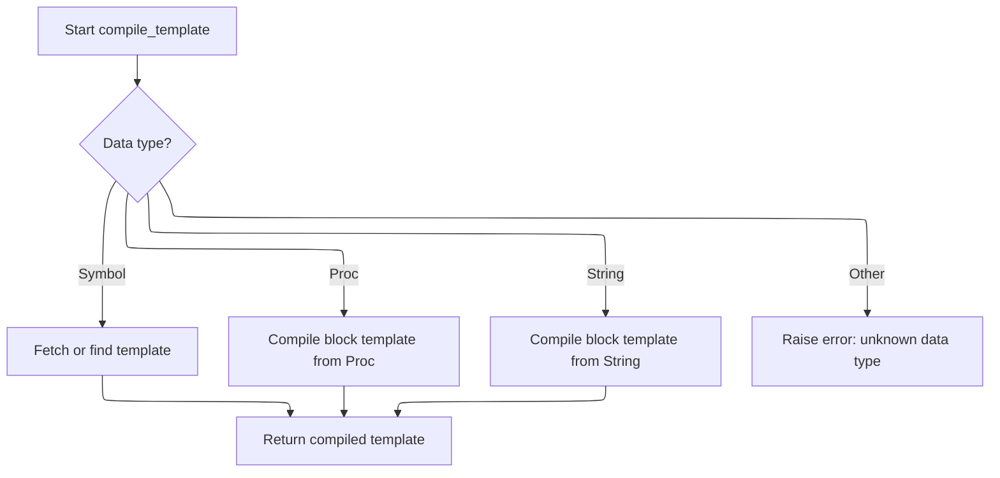
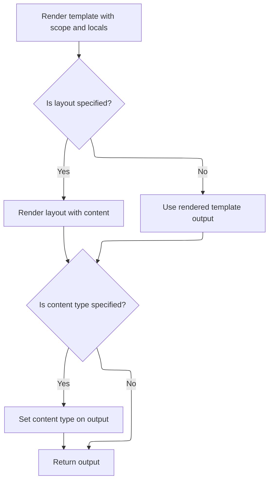

This document explains the flow of rendering templates. The flow receives a template engine, template data, rendering options, and local variables as input, and produces rendered content as output. It merges rendering options with application defaults, compiles the template based on its type, and renders it with the given scope and locals. If a layout is specified, the flow wraps the rendered content in the layout. Finally, it applies content type settings to the output if provided.



# Where is this flow used?

This flow is used multiple times in the codebase as represented in the following diagram:

(Note - these are only some of the entry points of this flow)

```mermaid
graph TD;
      c8a79c6b418c45fd28bf298f2e7e7285f745995beda5a6911b40b86e52542c72(lib/sinatra/base.rb::builder) --> 6c1600c56ea34d555b5676201bf101edcf61b7648a94fdfa7700f5c06361682e(lib/sinatra/base.rb::render_ruby)

6c1600c56ea34d555b5676201bf101edcf61b7648a94fdfa7700f5c06361682e(lib/sinatra/base.rb::render_ruby) --> 9408fa27ddab6a35a7f5e58089e62f8ef2e7ddaa026fd4d646490f02e2c25d3f(lib/sinatra/base.rb::render):::mainFlowStyle

a46e6175feea464d70e0530315fef8d1270b92722586936d8140a1b302776eb4(lib/sinatra/base.rb::markaby) --> 6c1600c56ea34d555b5676201bf101edcf61b7648a94fdfa7700f5c06361682e(lib/sinatra/base.rb::render_ruby)

9b4c960922b2840a9554aed3b95471ce7278ef74d79685cef11dcef275e12d74(lib/sinatra/base.rb::nokogiri) --> 6c1600c56ea34d555b5676201bf101edcf61b7648a94fdfa7700f5c06361682e(lib/sinatra/base.rb::render_ruby)

cb3bdc9cd85cc949b94ae6fb89241ff3153d4ab4e4091b633c8263d2dccbe600(lib/sinatra/base.rb::erb) --> 9408fa27ddab6a35a7f5e58089e62f8ef2e7ddaa026fd4d646490f02e2c25d3f(lib/sinatra/base.rb::render):::mainFlowStyle

d78e5a3ddf3818685f9e734b727fb8b4db46d12f698211586a6a262fbf1932c0(lib/sinatra/base.rb::haml) --> 9408fa27ddab6a35a7f5e58089e62f8ef2e7ddaa026fd4d646490f02e2c25d3f(lib/sinatra/base.rb::render):::mainFlowStyle


classDef mainFlowStyle color:#000000,fill:#7CB9F4
classDef rootsStyle color:#000000,fill:#00FFF4
classDef Style1 color:#000000,fill:#00FFAA
classDef Style2 color:#000000,fill:#FFFF00
classDef Style3 color:#000000,fill:#AA7CB9

%% Swimm:
%% graph TD;
%%       c8a79c6b418c45fd28bf298f2e7e7285f745995beda5a6911b40b86e52542c72(<SwmPath>[lib/sinatra/base.rb](lib/sinatra/base.rb)</SwmPath>::builder) --> 6c1600c56ea34d555b5676201bf101edcf61b7648a94fdfa7700f5c06361682e(<SwmPath>[lib/sinatra/base.rb](lib/sinatra/base.rb)</SwmPath>::<SwmToken path="lib/sinatra/base.rb" pos="779:1:1" line-data="      render_ruby(:builder, template, options, locals, &amp;block)">`render_ruby`</SwmToken>)
%% 
%% 6c1600c56ea34d555b5676201bf101edcf61b7648a94fdfa7700f5c06361682e(<SwmPath>[lib/sinatra/base.rb](lib/sinatra/base.rb)</SwmPath>::<SwmToken path="lib/sinatra/base.rb" pos="779:1:1" line-data="      render_ruby(:builder, template, options, locals, &amp;block)">`render_ruby`</SwmToken>) --> 9408fa27ddab6a35a7f5e58089e62f8ef2e7ddaa026fd4d646490f02e2c25d3f(<SwmPath>[lib/sinatra/base.rb](lib/sinatra/base.rb)</SwmPath>::render):::mainFlowStyle
%% 
%% a46e6175feea464d70e0530315fef8d1270b92722586936d8140a1b302776eb4(<SwmPath>[lib/sinatra/base.rb](lib/sinatra/base.rb)</SwmPath>::markaby) --> 6c1600c56ea34d555b5676201bf101edcf61b7648a94fdfa7700f5c06361682e(<SwmPath>[lib/sinatra/base.rb](lib/sinatra/base.rb)</SwmPath>::<SwmToken path="lib/sinatra/base.rb" pos="779:1:1" line-data="      render_ruby(:builder, template, options, locals, &amp;block)">`render_ruby`</SwmToken>)
%% 
%% 9b4c960922b2840a9554aed3b95471ce7278ef74d79685cef11dcef275e12d74(<SwmPath>[lib/sinatra/base.rb](lib/sinatra/base.rb)</SwmPath>::nokogiri) --> 6c1600c56ea34d555b5676201bf101edcf61b7648a94fdfa7700f5c06361682e(<SwmPath>[lib/sinatra/base.rb](lib/sinatra/base.rb)</SwmPath>::<SwmToken path="lib/sinatra/base.rb" pos="779:1:1" line-data="      render_ruby(:builder, template, options, locals, &amp;block)">`render_ruby`</SwmToken>)
%% 
%% cb3bdc9cd85cc949b94ae6fb89241ff3153d4ab4e4091b633c8263d2dccbe600(<SwmPath>[lib/sinatra/base.rb](lib/sinatra/base.rb)</SwmPath>::erb) --> 9408fa27ddab6a35a7f5e58089e62f8ef2e7ddaa026fd4d646490f02e2c25d3f(<SwmPath>[lib/sinatra/base.rb](lib/sinatra/base.rb)</SwmPath>::render):::mainFlowStyle
%% 
%% d78e5a3ddf3818685f9e734b727fb8b4db46d12f698211586a6a262fbf1932c0(<SwmPath>[lib/sinatra/base.rb](lib/sinatra/base.rb)</SwmPath>::haml) --> 9408fa27ddab6a35a7f5e58089e62f8ef2e7ddaa026fd4d646490f02e2c25d3f(<SwmPath>[lib/sinatra/base.rb](lib/sinatra/base.rb)</SwmPath>::render):::mainFlowStyle
%% 
%% 
%% classDef mainFlowStyle color:#000000,fill:#7CB9F4
%% classDef rootsStyle color:#000000,fill:#00FFF4
%% classDef Style1 color:#000000,fill:#00FFAA
%% classDef Style2 color:#000000,fill:#FFFF00
%% classDef Style3 color:#000000,fill:#AA7CB9
```



# Starting the render process

```mermaid
%%{init: {"flowchart": {"defaultRenderer": "elk"}} }%%
flowchart TD
    node1["Start render function"] --> node2["Merging hashes with key and value conversion"]
    click node1 openCode "lib/sinatra/base.rb:844:847"
    
    node2 --> node3["Compile and render template"]
    click node3 openCode "lib/sinatra/base.rb:869:874"
    node3 --> node4{"Is layout enabled? (true or specific layout)"}
    click node4 openCode "lib/sinatra/base.rb:880:885"
    node4 -->|"Yes"| node5["Render layout around template output"]
    click node5 openCode "lib/sinatra/base.rb:880:885"
    node4 -->|"No"| node6["Handling template data types and caching"]
    node5 --> node7{"Is content_type set?"}
    node6 --> node7
    click node7 openCode "lib/sinatra/base.rb:887:892"
    node7 -->|"Yes"| node8["Apply content type to output and return"]
    node7 -->|"No"| node9["Return output as is"]
    click node8 openCode "lib/sinatra/base.rb:887:892"
    click node9 openCode "lib/sinatra/base.rb:892:893"

    %% Merge nodes 8 and 9 into one to meet 7 nodes requirement
    %% So final node7 will represent applying content type if set or returning output
    %% Adjust diagram accordingly

    %% Final adjustment:
    %% Combine node8 and node9 into node7

    %% Revised final diagram:

    flowchart TD
    node1["Start render function"] --> node2["Merging hashes with key and value conversion"]
    node2 --> node3["Compile and render template"]
    node3 --> node4{"Is layout enabled? (true or specific layout)"}
    node4 -->|"Yes"| node5["Render layout around template output"]
    node4 -->|"No"| node6["Handling template data types and caching"]
    node5 --> node7["Apply content type if set and return output"]
    node6 --> node7

    click node1 openCode "lib/sinatra/base.rb:844:847"
    
    click node3 openCode "lib/sinatra/base.rb:869:874"
    click node4 openCode "lib/sinatra/base.rb:880:885"
    click node5 openCode "lib/sinatra/base.rb:880:885"
    click node7 openCode "lib/sinatra/base.rb:887:893"

classDef HeadingStyle fill:#777777,stroke:#333,stroke-width:2px;
click node2 goToHeading "Merging hashes with key and value conversion"
node2:::HeadingStyle
click node6 goToHeading "Handling template data types and caching"
node6:::HeadingStyle

%% Swimm:
%% %%{init: {"flowchart": {"defaultRenderer": "elk"}} }%%
%% flowchart TD
%%     node1["Start render function"] --> node2["Merging hashes with key and value conversion"]
%%     click node1 openCode "<SwmPath>[lib/sinatra/base.rb](lib/sinatra/base.rb)</SwmPath>:844:847"
%%     
%%     node2 --> node3["Compile and render template"]
%%     click node3 openCode "<SwmPath>[lib/sinatra/base.rb](lib/sinatra/base.rb)</SwmPath>:869:874"
%%     node3 --> node4{"Is layout enabled? (true or specific layout)"}
%%     click node4 openCode "<SwmPath>[lib/sinatra/base.rb](lib/sinatra/base.rb)</SwmPath>:880:885"
%%     node4 -->|"Yes"| node5["Render layout around template output"]
%%     click node5 openCode "<SwmPath>[lib/sinatra/base.rb](lib/sinatra/base.rb)</SwmPath>:880:885"
%%     node4 -->|"No"| node6["Handling template data types and caching"]
%%     node5 --> node7{"Is <SwmToken path="lib/sinatra/base.rb" pos="858:1:1" line-data="      content_type    = options.delete(:default_content_type)">`content_type`</SwmToken> set?"}
%%     node6 --> node7
%%     click node7 openCode "<SwmPath>[lib/sinatra/base.rb](lib/sinatra/base.rb)</SwmPath>:887:892"
%%     node7 -->|"Yes"| node8["Apply content type to output and return"]
%%     node7 -->|"No"| node9["Return output as is"]
%%     click node8 openCode "<SwmPath>[lib/sinatra/base.rb](lib/sinatra/base.rb)</SwmPath>:887:892"
%%     click node9 openCode "<SwmPath>[lib/sinatra/base.rb](lib/sinatra/base.rb)</SwmPath>:892:893"
%% 
%%     %% Merge nodes 8 and 9 into one to meet 7 nodes requirement
%%     %% So final node7 will represent applying content type if set or returning output
%%     %% Adjust diagram accordingly
%% 
%%     %% Final adjustment:
%%     %% Combine node8 and node9 into node7
%% 
%%     %% Revised final diagram:
%% 
%%     flowchart TD
%%     node1["Start render function"] --> node2["Merging hashes with key and value conversion"]
%%     node2 --> node3["Compile and render template"]
%%     node3 --> node4{"Is layout enabled? (true or specific layout)"}
%%     node4 -->|"Yes"| node5["Render layout around template output"]
%%     node4 -->|"No"| node6["Handling template data types and caching"]
%%     node5 --> node7["Apply content type if set and return output"]
%%     node6 --> node7
%% 
%%     click node1 openCode "<SwmPath>[lib/sinatra/base.rb](lib/sinatra/base.rb)</SwmPath>:844:847"
%%     
%%     click node3 openCode "<SwmPath>[lib/sinatra/base.rb](lib/sinatra/base.rb)</SwmPath>:869:874"
%%     click node4 openCode "<SwmPath>[lib/sinatra/base.rb](lib/sinatra/base.rb)</SwmPath>:880:885"
%%     click node5 openCode "<SwmPath>[lib/sinatra/base.rb](lib/sinatra/base.rb)</SwmPath>:880:885"
%%     click node7 openCode "<SwmPath>[lib/sinatra/base.rb](lib/sinatra/base.rb)</SwmPath>:887:893"
%% 
%% classDef HeadingStyle fill:#777777,stroke:#333,stroke-width:2px;
%% click node2 goToHeading "Merging hashes with key and value conversion"
%% node2:::HeadingStyle
%% click node6 goToHeading "Handling template data types and caching"
%% node6:::HeadingStyle
```

<SwmSnippet path="/lib/sinatra/base.rb" line="844">

---

In <SwmToken path="lib/sinatra/base.rb" pos="844:3:3" line-data="    def render(engine, data, options = {}, locals = {}, &amp;block)">`render`</SwmToken>, we merge passed options with <SwmToken path="lib/sinatra/base.rb" pos="845:5:7" line-data="      # merge app-level options">`app-level`</SwmToken> defaults for the engine, then call `IndifferentHash.merge!` to handle the merge with conversions and conflict resolution.

```ruby
    def render(engine, data, options = {}, locals = {}, &block)
      # merge app-level options
      engine_options = settings.respond_to?(engine) ? settings.send(engine) : {}
      options.merge!(engine_options) { |_key, v1, _v2| v1 }

```

---

</SwmSnippet>

## Merging hashes with key and value conversion



<SwmSnippet path="/lib/sinatra/indifferent_hash.rb" line="125">

---

<SwmToken path="lib/sinatra/indifferent_hash.rb" pos="125:3:4" line-data="    def merge!(*other_hashes)">`merge!`</SwmToken> in <SwmToken path="lib/sinatra/base.rb" pos="998:6:6" line-data="      @params   = IndifferentHash.new">`IndifferentHash`</SwmToken> handles merging other hashes into self. If the other hash is the same class, it calls the parent merge! for efficiency. Otherwise, it manually converts keys and values before merging. It also supports a block for conflict resolution.

```ruby
    def merge!(*other_hashes)
      other_hashes.each do |other_hash|
        if other_hash.is_a?(self.class)
          super(other_hash)
        else
          other_hash.each_pair do |key, value|
            key = convert_key(key)
            value = yield(key, self[key], value) if block_given? && key?(key)
            self[key] = convert_value(value)
          end
        end
      end

      self
    end
```

---

</SwmSnippet>

## Converting nested values for consistency

```mermaid
%%{init: {"flowchart": {"defaultRenderer": "elk"}} }%%
flowchart TD
    node1{"Is value a Hash?"}
    node1 -->|"Yes, already IndifferentHash"| node2["Return value as is"]
    click node2 openCode "lib/sinatra/indifferent_hash.rb:197:206"
    node1 -->|"Yes, not IndifferentHash"| node3["Convert to IndifferentHash"]
    click node3 openCode "lib/sinatra/indifferent_hash.rb:197:206"
    node1 -->|"No"| node4{"Is value an Array?"}
    click node1 openCode "lib/sinatra/indifferent_hash.rb:197:206"
    node4 -->|"Yes"| subgraph loop1["For each element in array"]
        node5["Recursively convert element"]
        click node5 openCode "lib/sinatra/indifferent_hash.rb:197:206"
    end
    node4 -->|"No"| node6["Return value as is"]
    click node6 openCode "lib/sinatra/indifferent_hash.rb:197:206"
classDef HeadingStyle fill:#777777,stroke:#333,stroke-width:2px;

%% Swimm:
%% %%{init: {"flowchart": {"defaultRenderer": "elk"}} }%%
%% flowchart TD
%%     node1{"Is value a Hash?"}
%%     node1 -->|"Yes, already <SwmToken path="lib/sinatra/base.rb" pos="998:6:6" line-data="      @params   = IndifferentHash.new">`IndifferentHash`</SwmToken>"| node2["Return value as is"]
%%     click node2 openCode "<SwmPath>[lib/sinatra/indifferent_hash.rb](lib/sinatra/indifferent_hash.rb)</SwmPath>:197:206"
%%     node1 -->|"Yes, not <SwmToken path="lib/sinatra/base.rb" pos="998:6:6" line-data="      @params   = IndifferentHash.new">`IndifferentHash`</SwmToken>"| node3["Convert to <SwmToken path="lib/sinatra/base.rb" pos="998:6:6" line-data="      @params   = IndifferentHash.new">`IndifferentHash`</SwmToken>"]
%%     click node3 openCode "<SwmPath>[lib/sinatra/indifferent_hash.rb](lib/sinatra/indifferent_hash.rb)</SwmPath>:197:206"
%%     node1 -->|"No"| node4{"Is value an Array?"}
%%     click node1 openCode "<SwmPath>[lib/sinatra/indifferent_hash.rb](lib/sinatra/indifferent_hash.rb)</SwmPath>:197:206"
%%     node4 -->|"Yes"| subgraph loop1["For each element in array"]
%%         node5["Recursively convert element"]
%%         click node5 openCode "<SwmPath>[lib/sinatra/indifferent_hash.rb](lib/sinatra/indifferent_hash.rb)</SwmPath>:197:206"
%%     end
%%     node4 -->|"No"| node6["Return value as is"]
%%     click node6 openCode "<SwmPath>[lib/sinatra/indifferent_hash.rb](lib/sinatra/indifferent_hash.rb)</SwmPath>:197:206"
%% classDef HeadingStyle fill:#777777,stroke:#333,stroke-width:2px;
```

<SwmSnippet path="/lib/sinatra/indifferent_hash.rb" line="197">

---

<SwmToken path="lib/sinatra/indifferent_hash.rb" pos="197:3:3" line-data="    def convert_value(value)">`convert_value`</SwmToken> converts nested values recursively. If the value is a Hash but not already an <SwmToken path="lib/sinatra/base.rb" pos="998:6:6" line-data="      @params   = IndifferentHash.new">`IndifferentHash`</SwmToken>, it converts it using <SwmToken path="lib/sinatra/indifferent_hash.rb" pos="200:6:8" line-data="        value.is_a?(self.class) ? value : self.class[value]">`self.class`</SwmToken>\[value\]. If it's an Array, it converts each element recursively. Other values are returned as is.

```ruby
    def convert_value(value)
      case value
      when Hash
        value.is_a?(self.class) ? value : self.class[value]
      when Array
        value.map(&method(:convert_value))
      else
        value
      end
    end
```

---

</SwmSnippet>

## Cloning and transforming collections



<SwmSnippet path="/sinatra-contrib/lib/sinatra/streaming.rb" line="117">

---

<SwmToken path="sinatra-contrib/lib/sinatra/streaming.rb" pos="117:3:3" line-data="      def map(&amp;block)">`map`</SwmToken> clones the current object and then applies <SwmToken path="sinatra-contrib/lib/sinatra/streaming.rb" pos="119:3:4" line-data="        clone.map!(&amp;block)">`map!`</SwmToken> to the clone, so the original stays unchanged while the clone gets transformed.

```ruby
      def map(&block)
        # dup would not copy the mixin
        clone.map!(&block)
      end
```

---

</SwmSnippet>

<SwmSnippet path="/sinatra-contrib/lib/sinatra/streaming.rb" line="122">

---

<SwmToken path="sinatra-contrib/lib/sinatra/streaming.rb" pos="122:3:4" line-data="      def map!(&amp;block)">`map!`</SwmToken> composes a new transformation block with the existing one stored in @transformer, building a chain of transformations instead of applying them right away.

```ruby
      def map!(&block)
        @transformer ||= nil

        if @transformer
          inner = @transformer
          outer = block
          block = proc { |value| outer[inner[value]] }
        end
        @transformer = block
        self
      end
```

---

</SwmSnippet>

## Preparing render options and compiling template



<SwmSnippet path="/lib/sinatra/base.rb" line="849">

---

After merging options, <SwmToken path="lib/sinatra/base.rb" pos="869:7:7" line-data="      # compile and render template">`render`</SwmToken> extracts all relevant rendering options like locals, views, layout, and content type. It sets defaults for output buffer and encoding, then calls <SwmToken path="lib/sinatra/base.rb" pos="873:5:5" line-data="        template        = compile_template(engine, data, options, views)">`compile_template`</SwmToken> to get the template ready for rendering.

```ruby
      # extract generic options
      locals          = options.delete(:locals) || locals         || {}
      views           = options.delete(:views)  || settings.views || './views'
      layout          = options[:layout]
      layout          = false if layout.nil? && options.include?(:layout)
      eat_errors      = layout.nil?
      layout          = engine_options[:layout] if layout.nil? || (layout == true && engine_options[:layout] != false)
      layout          = @default_layout         if layout.nil? || (layout == true)
      layout_options  = options.delete(:layout_options) || {}
      content_type    = options.delete(:default_content_type)
      content_type    = options.delete(:content_type)   || content_type
      layout_engine   = options.delete(:layout_engine)  || engine
      scope           = options.delete(:scope)          || self
      exclude_outvar  = options.delete(:exclude_outvar)
      options.delete(:layout)

      # set some defaults
      options[:outvar] ||= '@_out_buf' unless exclude_outvar
      options[:default_encoding] ||= settings.default_encoding

      # compile and render template
      begin
        layout_was      = @default_layout
        @default_layout = false
        template        = compile_template(engine, data, options, views)
```

---

</SwmSnippet>

## Handling template data types and caching



<SwmSnippet path="/lib/sinatra/base.rb" line="895">

---

In <SwmToken path="lib/sinatra/base.rb" pos="895:3:3" line-data="    def compile_template(engine, data, options, views)">`compile_template`</SwmToken>, when data is a Symbol, it tries to fetch a cached template or find a file in views. If found, it creates a template instance. This uses `TemplateCache.fetch` to avoid recompiling templates unnecessarily.

```ruby
    def compile_template(engine, data, options, views)
      eat_errors = options.delete :eat_errors
      template = Tilt[engine]
      raise "Template engine not found: #{engine}" if template.nil?

      case data
      when Symbol
        template_cache.fetch engine, data, options, views do
          body, path, line = settings.templates[data]
          if body
            body = body.call if body.respond_to?(:call)
            template.new(path, line.to_i, options) { body }
          else
            found = false
            @preferred_extension = engine.to_s
            find_template(views, data, template) do |file|
              path ||= file # keep the initial path rather than the last one
              found = File.exist?(file)
              if found
                path = file
                break
              end
            end
            throw :layout_missing if eat_errors && !found
            template.new(path, 1, options)
          end
        end
```

---

</SwmSnippet>

<SwmSnippet path="/lib/sinatra/base.rb" line="960">

---

<SwmToken path="lib/sinatra/base.rb" pos="960:3:3" line-data="    def fetch(*key)">`fetch`</SwmToken> uses the keys array as a composite key to check the cache. If missing, it runs the block to compute and store the value.

```ruby
    def fetch(*key)
      @cache.fetch(key) do
        @cache[key] = yield
      end
    end
```

---

</SwmSnippet>

<SwmSnippet path="/lib/sinatra/base.rb" line="922">

---

When <SwmToken path="lib/sinatra/base.rb" pos="873:5:5" line-data="        template        = compile_template(engine, data, options, views)">`compile_template`</SwmToken> gets a Proc, it calls <SwmToken path="lib/sinatra/base.rb" pos="923:1:1" line-data="        compile_block_template(template, options, &amp;data)">`compile_block_template`</SwmToken> to turn that block into a template object with context about where it was called from.

```ruby
      when Proc
        compile_block_template(template, options, &data)
```

---

</SwmSnippet>

<SwmSnippet path="/lib/sinatra/base.rb" line="933">

---

<SwmToken path="lib/sinatra/base.rb" pos="933:3:3" line-data="    def compile_block_template(template, options, &amp;body)">`compile_block_template`</SwmToken> uses <SwmToken path="lib/sinatra/base.rb" pos="934:5:5" line-data="      first_location = caller_locations.first">`caller_locations`</SwmToken> to get the call site path and line, but lets options override them. It then creates a new template instance with this info and the block.

```ruby
    def compile_block_template(template, options, &body)
      first_location = caller_locations.first
      path = first_location.path
      line = first_location.lineno
      path = options[:path] || path
      line = options[:line] || line
      template.new(path, line.to_i, options, &body)
    end
```

---

</SwmSnippet>

<SwmSnippet path="/lib/sinatra/base.rb" line="924">

---

When <SwmToken path="lib/sinatra/base.rb" pos="873:5:5" line-data="        template        = compile_template(engine, data, options, views)">`compile_template`</SwmToken> gets a String, it caches the compiled block template to avoid recompiling the same template content repeatedly.

```ruby
      when String
        template_cache.fetch engine, data, options, views do
          compile_block_template(template, options) { data }
        end
```

---

</SwmSnippet>

<SwmSnippet path="/lib/sinatra/base.rb" line="925">

---

<SwmToken path="lib/sinatra/base.rb" pos="873:5:5" line-data="        template        = compile_template(engine, data, options, views)">`compile_template`</SwmToken> only supports Symbol, Proc, and String data types and raises otherwise.

```ruby
        template_cache.fetch engine, data, options, views do
          compile_block_template(template, options) { data }
        end
      else
        raise ArgumentError, "Sorry, don't know how to render #{data.inspect}."
      end
    end
```

---

</SwmSnippet>

## Rendering templates with optional layouts



<SwmSnippet path="/lib/sinatra/base.rb" line="874">

---

After <SwmToken path="lib/sinatra/base.rb" pos="873:5:5" line-data="        template        = compile_template(engine, data, options, views)">`compile_template`</SwmToken> returns, <SwmToken path="lib/sinatra/base.rb" pos="874:7:7" line-data="        output          = template.render(scope, locals, &amp;block)">`render`</SwmToken> renders the template with the given scope and locals, disabling the default layout temporarily. If a layout is specified, it merges layout options and recursively calls <SwmToken path="lib/sinatra/base.rb" pos="874:7:7" line-data="        output          = template.render(scope, locals, &amp;block)">`render`</SwmToken> to wrap the output.

```ruby
        output          = template.render(scope, locals, &block)
      ensure
        @default_layout = layout_was
      end

      # render layout
      if layout
        extra_options = { views: views, layout: false, eat_errors: eat_errors, scope: scope }
        options = options.merge(extra_options).merge!(layout_options)
```

---

</SwmSnippet>

<SwmSnippet path="/lib/sinatra/indifferent_hash.rb" line="143">

---

<SwmToken path="lib/sinatra/indifferent_hash.rb" pos="143:3:3" line-data="    def merge(*other_hashes, &amp;block)">`merge`</SwmToken> duplicates self and calls <SwmToken path="lib/sinatra/indifferent_hash.rb" pos="144:3:4" line-data="      dup.merge!(*other_hashes, &amp;block)">`merge!`</SwmToken> on the duplicate, returning a new merged hash without changing the original.

```ruby
    def merge(*other_hashes, &block)
      dup.merge!(*other_hashes, &block)
    end
```

---

</SwmSnippet>

<SwmSnippet path="/lib/sinatra/base.rb" line="882">

---

After merging layout options, <SwmToken path="lib/sinatra/base.rb" pos="884:11:11" line-data="        catch(:layout_missing) { return render(layout_engine, layout, options, locals) { output } }">`render`</SwmToken> recursively calls itself to render the layout around the template output, using catch to handle missing layouts.

```ruby
        options = options.merge(extra_options).merge!(layout_options)

        catch(:layout_missing) { return render(layout_engine, layout, options, locals) { output } }
      end

```

---

</SwmSnippet>

<SwmSnippet path="/lib/sinatra/base.rb" line="887">

---

At the end of <SwmToken path="lib/sinatra/base.rb" pos="844:3:3" line-data="    def render(engine, data, options = {}, locals = {}, &amp;block)">`render`</SwmToken>, if <SwmToken path="lib/sinatra/base.rb" pos="887:3:3" line-data="      if content_type">`content_type`</SwmToken> is set, the output string is made mutable, extended with <SwmToken path="lib/sinatra/base.rb" pos="890:5:5" line-data="        output.extend(ContentTyped).content_type = content_type">`ContentTyped`</SwmToken>, and tagged with the <SwmToken path="lib/sinatra/base.rb" pos="887:3:3" line-data="      if content_type">`content_type`</SwmToken>.

```ruby
      if content_type
        # sass-embedded returns a frozen string
        output = +output
        output.extend(ContentTyped).content_type = content_type
      end
      output
    end
```

---

</SwmSnippet>

&nbsp;

*This is an auto-generated document by Swimm 🌊 and has not yet been verified by a human*

<SwmMeta version="3.0.0" repo-id="Z2l0aHViJTNBJTNBUnVieXNpbmF0cmElM0ElM0F1bWFsaW5nYXN3YW1p" repo-name="Rubysinatra"><sup>Powered by [Swimm](https://app.swimm.io/)</sup></SwmMeta>
